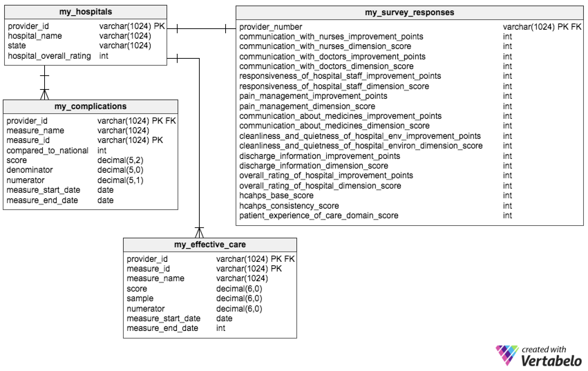

Noah Randolph
30 Oct. 2017

This README document will also serve as the architecture design document.

To run the program, clone the repository "Medicare-Quality-of-Care" from the Github account for noahrandolph. Run the command "./run_all_scripts.sh". This assumes you have the connectivity and system requirements including Spark-SQL, Hadoop distributed file system (HDFS), Postgres, Hive Metastore, and the Bash Unix shell.

The high-level design of the program begins with downloading and saving the Medicare .csv files from data.medicare.gov into a staging directory. The headers are removed from each of the five .csv files of interest and the files are renamed. HDFS directories are then created and the five files are moved into them. All of the preceding actions are executed via the "load_data_lake.sh" script.

Next, a schema-on-read is defined in the script "hive_base_ddl.sql" using Spark-SQL. The schema structure can be seen in the file "ERD_Schema_on_Read.png." 

Following the schema-on-read, the data is then transformed into analytical tables, with proper data types and useful transformations. See the file "ERD_Analytical_Exercise_1.png" for the analytical schema. For each table in the schema, data rows with no available data are assumed to be without analytic usefulness and are removed. Only certain columns from the original "ERD_Schema_on_Read.png" tables remain, based on their analytical utility. The original table "measures" is not used in the analytical ERD, since it was found to have redundant information with the "complications" and "effective_care" tables, as well as the fact that the dates in the data do not span far back in history.

BEST HOSPITALS

ID	NAME						OVERALL COMPLICATIONS RATING EFFECTIVE CARE %	EFFECTIVE CARE TIMING
450184  MEMORIAL HERMANN HOSPITAL SYSTEM        	5      	2.2941  	     80.125		29.5
361307	UHHS MEMORIAL HOSPITAL OF GENEVA		5	2.25		     91.8333		34
450431	ST DAVID'S MEDICAL CENTER			5	2.2353		     96.57146
050238	METHODIST HOSPITAL OF SOUTHERN CA		5	2.2353		     94.6667		12
450610	MEMORIAL HERMANN MEMORIAL CITY MEDICAL CENTER	5	2.2353		     83.1429		5
420087	ROPER HOSPITAL					5	2.1765		     95.4286		4
150057	FRANCISCAN HEALTH MOORESVILLE			5	2.1429		     94.8		21.5
050324	SCRIPPS MEMORIAL HOSPITAL LA JOLLA		5	2.1176		     95.375		8
260006	MOSAIC LIFE CARE AT ST JOSEPH			5	2.1176		     91.25		6
010125	LAKELAND COMMUNITY HOSPITAL			5	2.1111		     91			0
